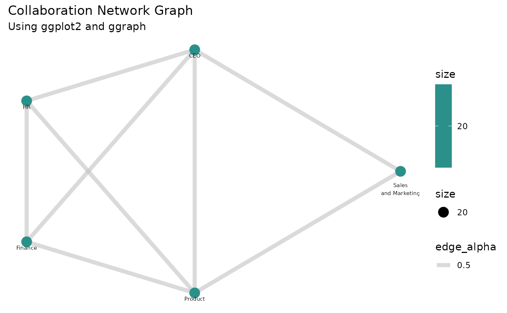

# Plotting a Network Graph using network_g2g

This script demonstrates how to generate and visualize a network graph
using the network_g2g function. The function creates an igraph object,
which can be plotted to display connections between organizations based
on collaboration metrics.

## Step 1: load libraries and sample data

In this example, we will use the sample `g2g_data` dataset from the
**vivainsights** package. We will also use **dplyr** and **purrr** for
data manipulation and iteration respectively, as well as the **igraph**
package for network graph creation and visualization.

``` r
library(vivainsights)
library(dplyr)
library(igraph)
library(ggplot2)
library(ggraph)
library(RColorBrewer)

# Display the first few rows of the dataset
head(g2g_data)
```

    ## # A tibble: 6 × 11
    ##   PrimaryCollaborator_Organization PrimaryCollaborator_…¹ SecondaryCollaborato…²
    ##   <chr>                                             <dbl> <chr>                 
    ## 1 Sales and Marketing                                 137 HR                    
    ## 2 Sales and Marketing                                 137 Unclassified Collabor…
    ## 3 Sales and Marketing                                 137 CEO                   
    ## 4 Sales and Marketing                                 137 Within Group          
    ## 5 Sales and Marketing                                 137 Product               
    ## 6 Sales and Marketing                                 137 Finance               
    ## # ℹ abbreviated names: ¹​PrimaryCollaborator_GroupSize,
    ## #   ²​SecondaryCollaborator_Organization
    ## # ℹ 8 more variables: SecondaryCollaborator_GroupSize <dbl>, MetricDate <chr>,
    ## #   Percent_Group_collaboration_time_invested <dbl>,
    ## #   Group_collaboration_time_invested <dbl>, Group_email_sent_count <dbl>,
    ## #   Group_email_time_invested <dbl>, Group_meeting_count <dbl>,
    ## #   Group_meeting_time_invested <dbl>

## Step 2: Generate the igraph network object

The
[`network_g2g()`](https://microsoft.github.io/vivainsights/reference/network_g2g.md)
function constructs a network graph based on collaboration data. We set:

- `primary` and `secondary` to define the connection points
- `metric` to specify the weight of relationships
- `return = "network"` to get an igraph object

``` r
g <- network_g2g(
    data = g2g_data,
    primary = "PrimaryCollaborator_Organization",
    secondary = "SecondaryCollaborator_Organization",
    metric = "Group_meeting_time_invested", 
    return = "network"
)
```

## Step 3: Prepare and customize the graph for visualization

Before plotting, we refine the graph by:

- Removing `loops` (self-connections) and `multiple edges` (redundant
  links)
- Setting vertex sizes based on the “org_size” attribute
- Defining a layout using `Multidimensional Scaling (MDS)`

``` r
# Simplify the graph (remove redundant edges and self-loops)
g <- simplify(g, remove.multiple = TRUE, remove.loops = TRUE)

# Scale node size based on organizational size
V(g)$size <- V(g)$org_size  

# Generate the MDS layout for better visual clarity
layout_mds <- layout_with_mds(g)
```

## Step 4: Customize and plot the network graph

We set vertex and edge properties for better readability:

- `Vertex color` → blue
- `Edge color` → grey
- `Vertex labels` → organization names
- `Edge width` → fixed at 2 for clarity
- `Transparency (alpha)` for edges (adjusted manually)

``` r
# Example: Assign colors based on an attribute (assuming 'group' exists in V(g))
unique_groups <- unique(V(g)$group)  
color_palette <- rainbow(length(unique_groups))  # Generate distinct colors

# Assign colors based on group
vertex_color <- color_palette[as.numeric(factor(V(g)$group))]

# Use a color gradient from the 'Blues' palette
vertex_color <- colorRampPalette(brewer.pal(9, "Blues"))(length(V(g)))

# Assign colors based on scaled size values
vertex_color <- vertex_color[rank(V(g)$size)]

set.seed(123)  # For reproducibility
vertex_color <- sample(colors(), length(V(g)), replace = TRUE)

# Define vertex and edge attributes
#vertex_color <- "blue"  # Set all vertices to blue
edge_color <- "grey"    # Set all edges to grey
vertex_labels <- V(g)$name  # Use vertex names as labels

# Plot the graph with customized settings
plot(
  g,
  layout = layout_mds,           # Use the MDS layout
  vertex.color = vertex_color,   # Set vertex colors
  vertex.label = vertex_labels,  # Assign labels
  vertex.frame.color = "black",  # Define frame color for vertices
  vertex.size = V(g)$size,       # Scale vertex size
  edge.color = edge_color,       # Set edge colors
  edge.width = 2,                # Define edge width
  edge.alpha = 0.5,              # Adjust transparency (workaround)
  vertex.label.dist = 4          # Control label positioning
)
```


## Step 5: Visualizing the Network Graph using `ggplot2`

Instead of using the base plot() function, we can leverage `ggplot2`
along with `ggraph` for a more refined and customizable visualization.

``` r
# Convert the igraph object into a dataframe for plotting
edges_df <- as_data_frame(g, what = "edges")
vertices_df <- as_data_frame(g, what = "vertices")

# Generate Layout (MDS)
layout_mds <- layout_with_mds(g)
vertices_df$x <- layout_mds[, 1]
vertices_df$y <- layout_mds[, 2]

vertices_df$color <- viridis::viridis(n = nrow(vertices_df), option = "C")

ggraph(g, layout = "mds") +
  geom_edge_link(aes(edge_alpha = 0.5), color = "grey", width = 2) +  
  geom_node_point(aes(size = size, color = size)) +
  geom_node_text(aes(label = name), vjust = 2, size = 2) +  
  scale_color_viridis_c() +
  theme_minimal() +
  labs(title = "Collaboration Network Graph", subtitle = "Using ggplot2 and ggraph") +
  theme(panel.grid = element_blank(), 
        axis.title = element_blank(), 
        axis.text = element_blank(), 
        axis.ticks = element_blank())
```



This final plot displays a network of collaborations based on the
meeting time invested between different organizations.
