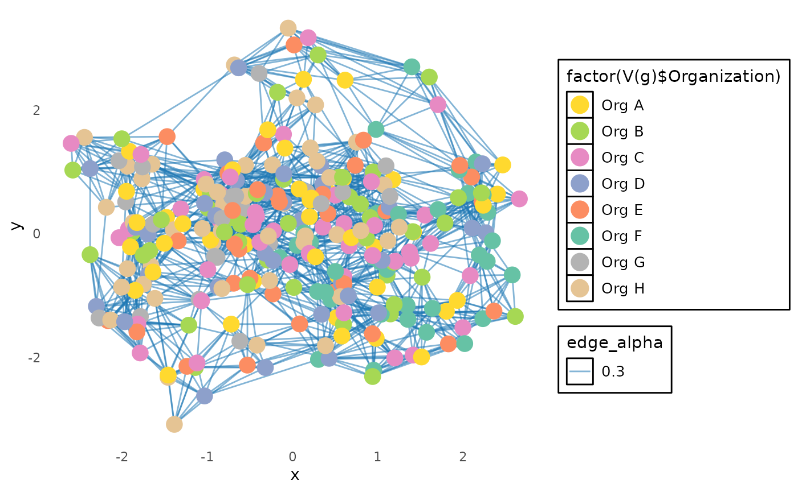

# Plotting a Network Graph using network_p2p

This script demonstrates how to generate and visualize a network graph
using the `network_p2p` function. The function creates an `igraph`
object, which can be plotted to display connections between individuals
based on collaboration metrics.

## Step 1: Load libraries and sample data

In this example, we will use the sample
[`p2p_data_sim()`](https://microsoft.github.io/vivainsights/reference/p2p_data_sim.md)
dataset from the **vivainsights** package. We will also use **dplyr**
for data manipulation, **igraph** for network graph creation,
**ggplot2** for visualization, and **ggraph** for enhanced network
plotting.

``` r
library(igraph)
library(ggplot2)
library(RColorBrewer)
library(ggraph)
library(dplyr)
library(vivainsights)

# Define HR variable
hrvar_text <- "Organization"

# Display the first few rows of the dataset
head(p2p_data_sim())
```

    ##   PrimaryCollaborator_PersonId SecondaryCollaborator_PersonId
    ## 1                     SIM_ID_1                       SIM_ID_2
    ## 2                     SIM_ID_2                       SIM_ID_3
    ## 3                     SIM_ID_3                       SIM_ID_4
    ## 4                     SIM_ID_4                       SIM_ID_5
    ## 5                     SIM_ID_5                       SIM_ID_6
    ## 6                     SIM_ID_6                       SIM_ID_7
    ##   PrimaryCollaborator_Organization SecondaryCollaborator_Organization
    ## 1                            Org F                              Org F
    ## 2                            Org F                              Org E
    ## 3                            Org E                              Org D
    ## 4                            Org D                              Org C
    ## 5                            Org C                              Org B
    ## 6                            Org B                              Org A
    ##   PrimaryCollaborator_LevelDesignation SecondaryCollaborator_LevelDesignation
    ## 1                              Level 1                                Level 2
    ## 2                              Level 2                                Level 3
    ## 3                              Level 3                                Level 4
    ## 4                              Level 4                                Level 5
    ## 5                              Level 5                                Level 6
    ## 6                              Level 6                                Level 7
    ##   PrimaryCollaborator_City SecondaryCollaborator_City StrongTieScore
    ## 1                   City C                     City B              1
    ## 2                   City B                     City A              1
    ## 3                   City A                     City B              1
    ## 4                   City B                     City C              1
    ## 5                   City C                     City A              1
    ## 6                   City A                     City C              1

## Step 2: Generate the igraph network object

The
[`network_p2p()`](https://microsoft.github.io/vivainsights/reference/network_p2p.md)
function constructs a network graph based on collaboration data. We set:

- `data` to the simulated P2P dataset
- `hrvar` to define the grouping attribute
- `return = "network"` to get an igraph object

``` r
g <- network_p2p(
  data = p2p_data_sim(), 
  hrvar = hrvar_text, 
  return = "network")

# Ensure g is an igraph object
if (!inherits(g, "igraph")) {
  stop("network_p2p did not return an igraph object. Check function parameters.")
}
```

## Step 3: Prepare and customize the graph for visualization

Before plotting, we refine the graph by:

- Removing `loops` (self-connections) and `multiple edges` (redundant
  links)
- Extracting unique values for color mapping
- Assigning colors and scaling node sizes

``` r
# Simplify the graph (remove redundant edges and self-loops)
g <- simplify(g, remove.multiple = TRUE, remove.loops = TRUE)

# Extract unique values for color mapping
unique_values <- unique(V(g)$Organization)
num_unique_values <- length(unique_values)

# Generate a color palette
colors <- brewer.pal(min(num_unique_values, 8), "Set2")
org_to_color <- setNames(colors, unique_values)

# Assign colors and scale node sizes
V(g)$node_color <- org_to_color[V(g)$Organization]
V(g)$node_size <- V(g)$node_size * 120  # Ensure this attribute exists
```

## Step 4: Customize and plot the network graph

We use `ggraph` to create a visually appealing graph with:

- `Edge color` → blue
- `Vertex color` → mapped to organization groups
- `Vertex size` → scaled according to `node_size`
- `Theme` adjustments for a dark background and enhanced readability

``` r
ggraph(g, layout = "mds") +
  geom_edge_link(aes(edge_alpha = 0.3), color = "#1f78b4") +
  geom_node_point(aes(size = V(g)$node_size, color = factor(V(g)$Organization))) +  
  scale_color_manual(values = org_to_color) +  
  theme_minimal(base_family = "sans") +  # Use a generic, available font
  theme(
    plot.background = element_rect(fill = "white", color = NA),
    panel.grid = element_blank(),  
    legend.text = element_text(size = 10, color = "black"),
    legend.background = element_rect(fill = "white"),
    legend.key = element_rect(fill = "white")
  ) +
  guides(color = guide_legend(override.aes = list(size = 5)), size = FALSE)
```

    ## Warning: The `<scale>` argument of `guides()` cannot be `FALSE`. Use "none" instead as
    ## of ggplot2 3.3.4.
    ## This warning is displayed once per session.
    ## Call `lifecycle::last_lifecycle_warnings()` to see where this warning was
    ## generated.



This final plot displays a network of peer-to-peer collaborations based
on organization groupings, using a structured and aesthetically refined
visualization.
