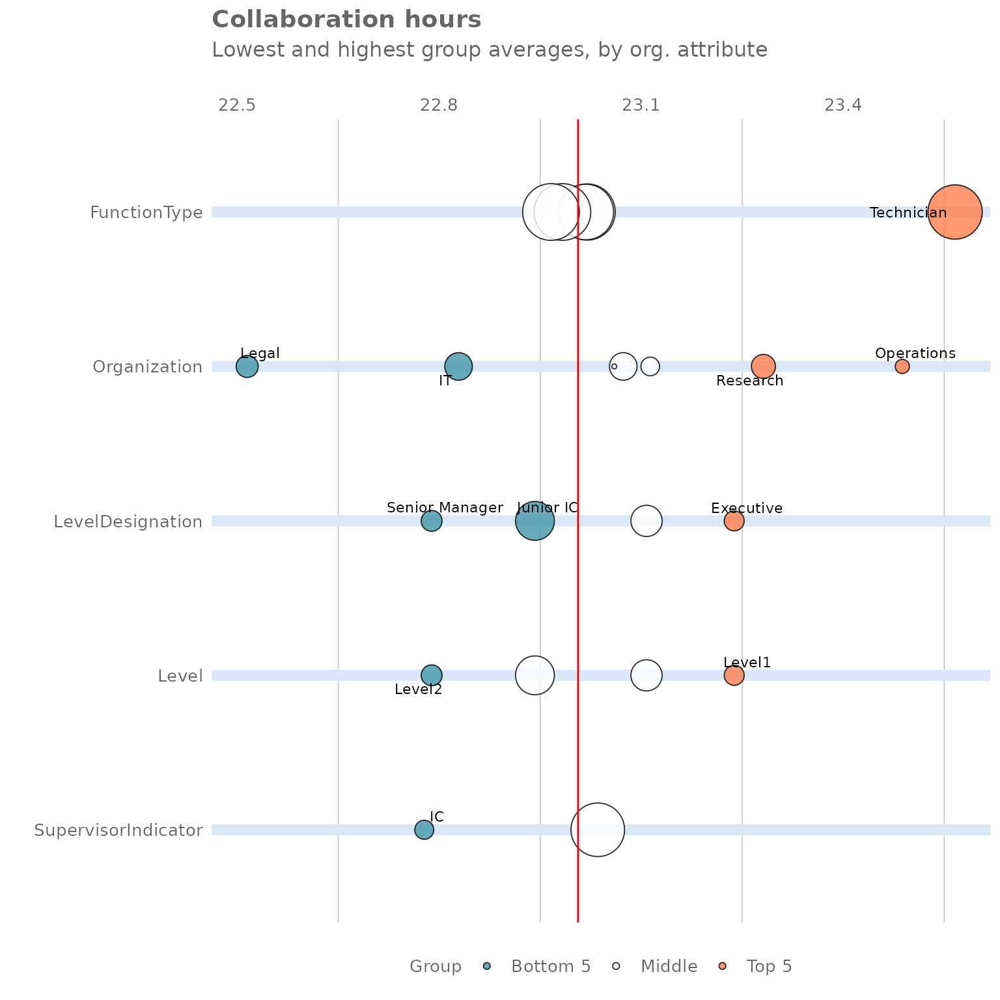

# Identifying noteworthy groups with rank functions

## Introduction

This article introduces the **rank functions** that are included in the
[**vivainsights** R package](https://microsoft.github.io/vivainsights).
These are powerful functions that scan a full person query dataset and
automatically identify noteworthy groups, i.e. those exhibiting the
highest or lowest values for a metric in the population.

Rank functions can uncover previously unknown patterns and interesting
trends, without analysts having to manually slice the data across
multiple attributes. You can think of them as a tool for *automatic
group exploration* - an efficient method for identifying the top and
bottom group of employees without manually reviewing all the possible
organisational divisions.

Additionally, these functions can reveal what combination of attributes
best describe a group that shows a specific behaviour (i.e for example,
what organisational attributes represent employees suffering from
excessive workload, receiving insufficient coaching, etc). As business
leaders often want to develop targeted interventions to address specific
issues, these functions can be a great way to inform action planning and
transformation initiatives.

This article is divided in four sections. After this introduction,
section two describes rank functions and show how them can be used with
person query outputs. In the following section, we explore their use for
profiling - i.e. to identify in which groups a specific behaviour is
most common. The fourth and final section includes a list of additional
use cases that can benefit from this method.

## Rank Functions

### Baseline analysis

To get started, let’s open a new session in R and load the
[**vivainsights** R package](https://microsoft.github.io/vivainsights).
We will also use **dplyr** to facilitate data manipulation:

``` r
library(vivainsights)
library(dplyr)
```

We will use the `pq_data` demo dataset, which contains a weekly person
query output, and apply the
[`collaboration_rank()`](https://microsoft.github.io/vivainsights/reference/collaboration_rank.md)
function:

``` r
pq_data %>% 
    collaboration_rank(return = "table")
#> # A tibble: 22 × 4
#>    hrvar            group      Collaboration_hours     n
#>    <chr>            <chr>                    <dbl> <int>
#>  1 FunctionType     Technician                23.6   274
#>  2 Organization     Operations                23.5    22
#>  3 Organization     Research                  23.3    52
#>  4 Level            Level1                    23.2    37
#>  5 LevelDesignation Executive                 23.2    37
#>  6 Organization     HR                        23.1    33
#>  7 Level            Level3                    23.1    87
#>  8 LevelDesignation Senior IC                 23.1    87
#>  9 Organization     Finance                   23.1    68
#> 10 Organization     Sales                     23.1    13
#> # ℹ 12 more rows
```

The output table contains the results from the automatic group
exploration. The rank function has taken all available organisational
attributes in this dataset (`FunctionType`, `Organization`,
`LevelDesignation`, and `IsActive`) and calculated the average
collaboration hours for each group within each organisational attribute.
The table shows the analysed results for all groups, ranked from highest
to lowest.

To view the entire table, we can add the function `print` to the command
above.

``` r
pq_data %>% 
    collaboration_rank(return = "table") %>%  
    print(n = 30)
#> # A tibble: 22 × 4
#>    hrvar               group          Collaboration_hours     n
#>    <chr>               <chr>                        <dbl> <int>
#>  1 FunctionType        Technician                    23.6   274
#>  2 Organization        Operations                    23.5    22
#>  3 Organization        Research                      23.3    52
#>  4 Level               Level1                        23.2    37
#>  5 LevelDesignation    Executive                     23.2    37
#>  6 Organization        HR                            23.1    33
#>  7 Level               Level3                        23.1    87
#>  8 LevelDesignation    Senior IC                     23.1    87
#>  9 Organization        Finance                       23.1    68
#> 10 Organization        Sales                         23.1    13
#> 11 SupervisorIndicator Manager                       23.0   266
#> 12 FunctionType        Advisor                       23.0   293
#> 13 FunctionType        Consultant                    23.0   288
#> 14 FunctionType        Specialist                    23.0   300
#> 15 FunctionType        Manager                       23.0   300
#> 16 Level               Level4                        22.9   136
#> 17 LevelDesignation    Junior IC                     22.9   136
#> 18 Organization        IT                            22.8    68
#> 19 Level               Level2                        22.8    40
#> 20 LevelDesignation    Senior Manager                22.8    40
#> 21 SupervisorIndicator IC                            22.8    34
#> 22 Organization        Legal                         22.5    44
```

This analysis shows us that the 82 employees labelled as
`"FunctionType = "Sales"` have the highest collaboration hours, with a
weekly average of 31 hours. In second place, there are 60 individuals in
`Organization = "Inventory Management"` with 26.2 hours. On the lower
end, the 75 employees labelled as `Organization = "Biz Dev"` appear to
have the lowest collaboration time.

This output is useful to identify groups that are worth investigating
(e.g. employees labelled as `"FunctionType = Sales"`). It also reveals
that splits by `FunctionType` and `Organization` are more interesting
than those by `LevelDesignation`, as they have more variation; all
groups in `LevelDesignation` have similar levels of collaboration,
between 18 and 22 hours a week. Rank functions can also display this
information in visual form. We can get that by changing the `return`
argument from `"table"` to `"plot"`:

``` r
pq_data %>% 
    collaboration_rank(return = "plot")
```



This plot contains the same information as the table above. Each row
corresponds to a different organisational attribute and the bubbles show
how the population is split across different subgroups, where bubble
size is proportional to the number of individuals. The five groups in
orange are clearly the ones spending most time in collaboration, with
Sales being far ahead of the other groups. Keep in mind that each row of
bubbles represents a different way to slice the same population, so
groups across rows are not mutually exclusive.

### Combining two HR variables

In our baseline analysis, we uncovered that the 82 employees labelled as
`FunctionType = "Sales"` have the highest average collaboration hours.
However, it is likely that some employees in this group are more
affected than others. Furthermore, there may be pockets in other parts
of this company that may be experiencing similar levels of collaboration
overload, but that are hidden given the structure of the organisational
data (for example, the managers within a particular business unit).

The rank function includes an additional mode called “combine” that
allows us to take our analysis one step further by performing on two HR
variables the same analysis in a combinatorial manner:

``` r
pq_data %>% 
    collaboration_rank(return = "table", mode = "combine")
#> # A tibble: 308 × 4
#>    hrvar    group                                      Collaboration_hours     n
#>    <chr>    <chr>                                                    <dbl> <int>
#>  1 Combined [FunctionType] Technician [SupervisorIndi…                23.8   243
#>  2 Combined [FunctionType] Consultant [SupervisorIndi…                23.1    33
#>  3 Combined [FunctionType] Advisor [SupervisorIndicat…                23.1   260
#>  4 Combined [FunctionType] Manager [SupervisorIndicat…                23.0   266
#>  5 Combined [FunctionType] Consultant [SupervisorIndi…                23.0   255
#>  6 Combined [FunctionType] Specialist [SupervisorIndi…                23.0   266
#>  7 Combined [FunctionType] Specialist [SupervisorIndi…                22.8    34
#>  8 Combined [FunctionType] Advisor [SupervisorIndicat…                22.6    33
#>  9 Combined [FunctionType] Manager [SupervisorIndicat…                22.5    34
#> 10 Combined [FunctionType] Technician [SupervisorIndi…                21.7    31
#> # ℹ 298 more rows
```

The output table contains similar results from the group exploration
above, but with more granularity. The function has automatically created
smaller groups by combining two distinct groups from the organisational
attributes in scope. In this case, it seems that the 28 managers in
Sales are the worst affected group, with a weekly average of 33.7 hours
in collaboration per week - that sounds like a lot of meetings!

### Additional functions

So far, we have limited our analysis to
[`collaboration_rank()`](https://microsoft.github.io/vivainsights/reference/collaboration_rank.md),
which only performs the analysis on the metric `Collaboration_hours`.
However, the [**vivainsights** R
package](https://microsoft.github.io/vivainsights) includes many other
rank functions for key Viva Insights metrics:

- [`afterhours_rank()`](https://microsoft.github.io/vivainsights/reference/afterhours_rank.md) -
  for `After_hours_collaboration_hours`

- [`email_rank()`](https://microsoft.github.io/vivainsights/reference/email_rank.md) -
  for `Email_hours`

- [`meeting_rank()`](https://microsoft.github.io/vivainsights/reference/meeting_rank.md) -
  for `Meeting_hours`

- [`one2one_rank()`](https://microsoft.github.io/vivainsights/reference/one2one_rank.md) -
  for `Meeting_hours_with_manager_1_on_1`

- `workloads_rank()` - for `Collaboration_span`

Additionally, if you want to apply this to any other numeric variable of
your choice, you can use the more general version below by specifying
the metric as a string with the argument `metric`:

- [`create_rank()`](https://microsoft.github.io/vivainsights/reference/create_rank.md)

## Using rank functions for profiling

In the previous section, we explored how rank functions can help
analysts uncover interesting insights, without the need of manually
slicing the data across multiple attributes.

Rank functions have an additional use: they can help us identify **what
combination of attributes best describe a group that shows a given
behaviour**. For example, we may be concerned about individuals that are
experiencing both a heavy collaboration load (more than 20 hours a week
on average) and long workweeks (workweek span of over 60 hours), and
would like to know where in the organisations these individuals sit.

To answer that question, let’s create a new numeric custom metric
(i.e. a binary flag that is only either `1` or `0`) and then apply the
[`create_rank()`](https://microsoft.github.io/vivainsights/reference/create_rank.md)
function:

``` r
pq_data %>%
    mutate(At_risk = ifelse(Collaboration_hours > 20 &  Collaboration_span > 60 , 1, 0)) %>%
    create_rank(metric = "At_risk", mode = "combine")
#> # A tibble: 308 × 4
#>    hrvar    group                                                  At_risk     n
#>    <chr>    <chr>                                                    <dbl> <int>
#>  1 Combined [FunctionType] Advisor [SupervisorIndicator] IC              0    33
#>  2 Combined [FunctionType] Advisor [SupervisorIndicator] Manager         0   260
#>  3 Combined [FunctionType] Consultant [SupervisorIndicator] IC           0    33
#>  4 Combined [FunctionType] Consultant [SupervisorIndicator] Manag…       0   255
#>  5 Combined [FunctionType] Manager [SupervisorIndicator] IC              0    34
#>  6 Combined [FunctionType] Manager [SupervisorIndicator] Manager         0   266
#>  7 Combined [FunctionType] Specialist [SupervisorIndicator] IC           0    34
#>  8 Combined [FunctionType] Specialist [SupervisorIndicator] Manag…       0   266
#>  9 Combined [FunctionType] Technician [SupervisorIndicator] IC           0    31
#> 10 Combined [FunctionType] Technician [SupervisorIndicator] Manag…       0   243
#> # ℹ 298 more rows
```

The custom `At_risk` variable identifies whether any particular
person-week exhibits high collaboration hours and long workweeks. By
combining this with
[`create_rank()`](https://microsoft.github.io/vivainsights/reference/create_rank.md),
the analysis reveals that the combination of heavy collaboration load
plus long workweeks is most prevalent among the 13 employees in
`FunctionType = "Sales"` and `LevelDesignation = "Junior IC"`. In other
words, the average employee of these groups experience high
collaboration load and long workweeks 31% of the time.

## Conclusion, use cases and other applications

In this article, we have shown how **rank functions** can be a powerful
tool to both uncover previously unknown patterns and to profile the
groups that are experiencing a certain behaviour. In the context of Viva
Insights, we see a wide range of applications in the areas of wellbeing,
ways of working, and sales excellence. Examples include:

- **Workload:** Identifying groups with excessive collaboration and long
  workdays
- **Freedom to disconnect:** Identifying groups with always-on
  behaviours
- **Coaching:** Identifying groups with insufficient coaching and
  manager time
- **Exposure:** Identifying groups with insufficient skip-level exposure
- **Isolation:** Identifying groups with insufficient cross-team
  collaboration
- **Sales performance:** Identifying groups with insufficient external
  collaboration

## Feedback

We hope you found this article useful!

If you have any suggestions or feedback, please submit an issue at
<https://github.com/microsoft/vivainsights/issues>.
