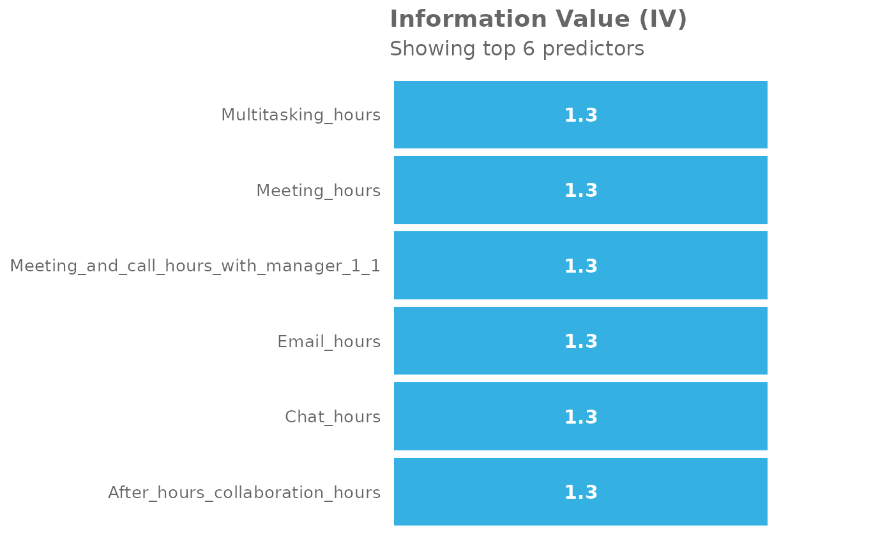
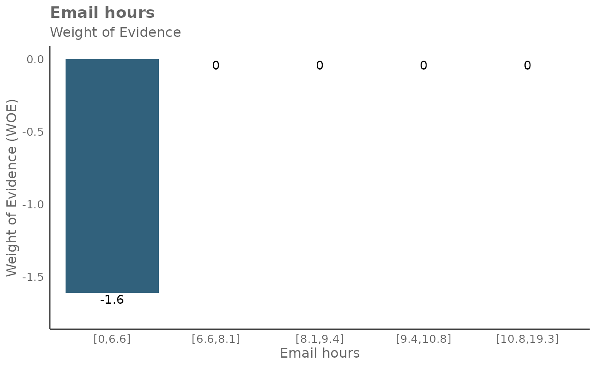
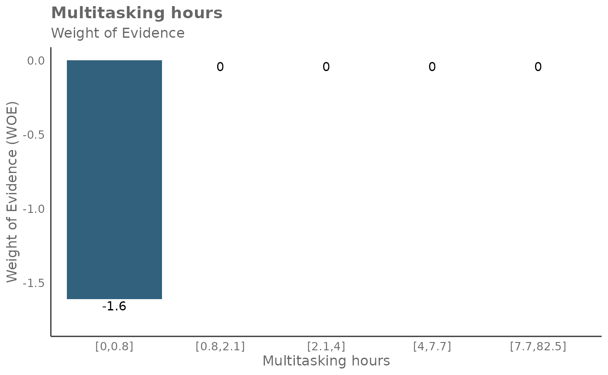

# Information Value analysis with the \*\*vivainsights\*\* R library

## Introduction

This notebook provides a demo on the Information Value (IV) functions
for the **vivainsights** package. For more information about the
package, please see:

- [Documentation](https://microsoft.github.io/vivainsights/)
- [GitHub Page](https://github.com/microsoft/vivainsights)

In this notebook, we will demo how to create analysis and visualizations
with the IV and plot-WOE queries from Viva Insights.

### Background

Information Value (IV) is a powerful methodology that provides a measure
of the predictive power of an individual independent variable in
relation to the dependent variable. In the context of Viva Insights,
independent variables could be a collaboration metric (e.g. Emails sent,
1:1 meeting time with managers), whereas a dependent variable could be a
categorical variable indicating whether a person is engaged, a top
performer, or at risk of attrition - likely provided through a survey.

IV quantifies the amount of information a variable provides about the
outcome. It is based on the following logic: a variable that is highly
informative of the outcome will have different distributions of values
for different outcome classes. For example, if we are predicting
employee engagement, a variable like collaboration hours might have a
different distribution for the engaged and non-engaged classes,
indicating that it is informative of the outcome.

The IV is calculated for each potential predictor variable, and the
variables are then ranked based on their IVs. This allows for the
selection of the most predictive variables for use in the model. The IV
methodology solves the problem of selecting the most predictive
variables for a predictive model. By ranking variables based on their
IVs, it allows for the selection of variables that are most informative
of the outcome, improving the predictive power of the model. It also
helps in identifying and excluding variables that are not predictive of
the outcome, which can improve model performance and interpretability.

### Set up

We start with loading the **vivainsights** package:

``` r
library(vivainsights)
```

    ## 
    ##  Thank you for using the {vivainsights} R package!
    ##  
    ##  Our analysts have taken every care to ensure that this package runs smoothly and bug-free.
    ##  
    ##  However, if you do happen to encounter any, please report any issues at
    ##  https://github.com/microsoft/vivainsights/issues/
    ##  
    ##  Happy coding!

``` r
library(dplyr)
```

    ## 
    ## Attaching package: 'dplyr'

    ## The following objects are masked from 'package:stats':
    ## 
    ##     filter, lag

    ## The following objects are masked from 'package:base':
    ## 
    ##     intersect, setdiff, setequal, union

The following shows a preview of the Person Query demo dataset:

``` r
head(pq_data)
```

    ## # A tibble: 6 × 73
    ##   PersonId                 MetricDate Collaboration_hours Copilot_actions_take…¹
    ##   <chr>                    <date>                   <dbl>                  <int>
    ## 1 7d99f98f-c0a6-4df9-b2c3… 2024-04-28                14.1                      5
    ## 2 68d86466-5864-45f1-9c15… 2024-04-28                26.0                      7
    ## 3 8c64bf0d-57fe-4a89-a538… 2024-04-28                25.7                      7
    ## 4 3a12dcc6-c5d5-46e4-a1d2… 2024-04-28                13.8                      4
    ## 5 a8f3ad16-01ea-4991-8d88… 2024-04-28                16.2                      5
    ## 6 d83e45d2-a702-4ec8-a84a… 2024-04-28                25.1                      5
    ## # ℹ abbreviated name: ¹​Copilot_actions_taken_in_Teams
    ## # ℹ 69 more variables: Meeting_and_call_hours <dbl>,
    ## #   Internal_network_size <int>, Email_hours <dbl>,
    ## #   Channel_message_posts <dbl>, Conflicting_meeting_hours <dbl>,
    ## #   Large_and_long_meeting_hours <dbl>, External_collaboration_hours <dbl>,
    ## #   Active_connected_hours <dbl>, Meetings <dbl>,
    ## #   After_hours_collaboration_hours <dbl>, Call_hours <dbl>, Calls <dbl>, …

### Calculating Information Value (IV)

To run the IV methodology, a binary dependent variable is required.

We can simulate such a variable by the following, and in this example we
can name the variable `IsLargeNetwork`:

``` r
pq_data$IsLargeNetwork <- ifelse(pq_data$Internal_network_size > 40, 1, 0)
```

We can then define a list of predictors, and assign this to
`predictor_list.`

As shown below,
[`create_IV()`](https://microsoft.github.io/vivainsights/reference/create_IV.md)
is the primary function for analyzing and visualizing Information Value
for a selected outcome variable. We use the `predictors` argument to
supply the list of predictors, and `outcome` to specify which varible to
use as the dependent variable.

In `return`, we specify a plot to be returned:

``` r
predictor_list <- c(
  "Email_hours",
  "Chat_hours",
  "Meeting_hours",
  "After_hours_collaboration_hours",
  "Multitasking_hours",
  "Meeting_and_call_hours_with_manager_1_1"
)

create_IV(
  pq_data,
  predictors = predictor_list,
  outcome = "IsLargeNetwork",
  return = "plot"
)
```



Here’s a general guideline on how to interpret the IV values:

- IV \< 0.02: The predictor is not useful for modeling (it has no
  predictive power).
- 0.02 \<= IV \< 0.1: The predictor has only a weak predictive power.
- 0.1 \<= IV \< 0.3: The predictor has a medium predictive power.
- 0.3 \<= IV \< 0.5: The predictor has a strong predictive power.
- IV \>= 0.5: The predictor has a suspiciously high predictive power,
  and may potentially indicate overfitting.
- These are just guidelines and the thresholds can vary depending on the
  context and the specific problem you’re working on. With real data,
  always consider the business context and use your judgement when
  interpreting the IV values.

### Other return options

In total, there are five return options that can be supplied to
[`create_IV()`](https://microsoft.github.io/vivainsights/reference/create_IV.md),
via `return`:

- “plot”
- “summary”
- “list”
- “plot-WOE”
- “IV” The below shows the results when `return = 'summary'`, which
  returns a DataFrame containing one row per predictor and its
  associated IV:

``` r
create_IV(
  pq_data,
  predictors = predictor_list,
  outcome = "IsLargeNetwork",
  return = "summary"
)
```

    ##                                  Variable       IV
    ## 1                             Email_hours 1.289015
    ## 2                              Chat_hours 1.289015
    ## 3                           Meeting_hours 1.289015
    ## 4         After_hours_collaboration_hours 1.289015
    ## 5                      Multitasking_hours 1.289015
    ## 6 Meeting_and_call_hours_with_manager_1_1 1.289015

It’s also possible to return Weight of Evidence (WoE) as a plot too. The
WoE for a given interval is calculated as the natural logarithm of the
proportion of positive outcomes to the proportion of negative outcomes.
In other words, it measures the evidence in favor of a particular
outcome given the value of the independent variable.

Here is the output for `return = 'plot-WOE'`:

``` r
create_IV(
  pq_data,
  predictors = predictor_list,
  outcome = "IsLargeNetwork",
  return = "plot-WOE"
)
```

    ## [[1]]



    ## 
    ## [[2]]


    ## 
    ## [[3]]


    ## 
    ## [[4]]


    ## 
    ## [[5]]



    ## 
    ## [[6]]


It’s also possible to return more detailed outputs behind the
calculations for `return = 'plot-WOE'`.

When `return = 'IV'`, a list of three items is returned.

``` r
result_iv <- create_IV(
                pq_data,
                predictors = predictor_list,
                outcome = "IsLargeNetwork",
                return = "IV"
              )
```

The first item in the list output is a dictionary of data frames that
contain information about WOE, IV, and probabilities. The second item in
the list output is a DataFrame of IV , identical to the output in
`return = 'summary'`. The third item in the list output is the natural
log odds.

You can extract them as follows:

``` r
result_iv[[1]]$Email_hours
```

    ## # A tibble: 5 × 5
    ##   Email_hours     N Percent   WOE    IV
    ##   <glue>      <int>   <dbl> <dbl> <dbl>
    ## 1 [0,6.6]      1379   0.200 -1.61  1.29
    ## 2 [6.6,8.1]    1380   0.2    0     1.29
    ## 3 [8.1,9.4]    1380   0.2    0     1.29
    ## 4 [9.4,10.8]   1380   0.2    0     1.29
    ## 5 [10.8,19.3]  1381   0.200  0     1.29

``` r
result_iv[[2]]
```

    ##                                  Variable       IV
    ## 1                             Email_hours 1.289015
    ## 2                              Chat_hours 1.289015
    ## 3                           Meeting_hours 1.289015
    ## 4         After_hours_collaboration_hours 1.289015
    ## 5                      Multitasking_hours 1.289015
    ## 6 Meeting_and_call_hours_with_manager_1_1 1.289015

``` r
result_iv[[3]]
```

    ## [1] 8.839132

Here is a guide on interpreting WoE, odds, and probabilities:

- A positive WoE value indicates that the odds of the event are higher
  for the group in question than for the entire dataset. In other words,
  the event is more likely to occur for this group.
- A negative WoE value indicates that the odds of the event are lower
  for the group in question than for the entire dataset. In other words,
  the event is less likely to occur for this group.
- A WoE of zero indicates that the odds of the event for the group are
  the same as for the entire dataset.

**Odds**: The odds of an event occurring is the ratio of the probability
of the event occurring to the probability of the event not occurring.

**Probability**: This is the likelihood of the event occurring, a value
between 0 and 1.

To return only this dictionary of DataFrames, you can also run
`return = 'list'`, which returns the identical dictionary:

``` r
result_iv_full = create_IV(
                    pq_data,
                    predictors = predictor_list,
                    outcome = "IsLargeNetwork",
                    return = "list"
                  )
```

``` r
result_iv_full$Email_hours
```

    ## # A tibble: 5 × 7
    ##   Email_hours     N Percent   WOE    IV  ODDS  PROB
    ##   <glue>      <int>   <dbl> <dbl> <dbl> <dbl> <dbl>
    ## 1 [0,6.6]      1379   0.200 -1.61  1.29  1378 0.999
    ## 2 [6.6,8.1]    1380   0.2    0     1.29  6899 1.000
    ## 3 [8.1,9.4]    1380   0.2    0     1.29  6899 1.000
    ## 4 [9.4,10.8]   1380   0.2    0     1.29  6899 1.000
    ## 5 [10.8,19.3]  1381   0.200  0     1.29  6899 1.000

### Notes

#### Additional arguments

There are two other arguments
[`create_IV()`](https://microsoft.github.io/vivainsights/reference/create_IV.md),
i.e. `siglevel` and `exc_sig` which controls whether significance
results are shown in the outputs. These are optional.

#### Methodology choice

When contemplating whether to use the Information Value methodology,
it’s worth noting that WoE has several advantages:

It can transform a continuous variable into a set of categories, which
can capture non-linear effects. It creates monotonic variables, which
are often better handled by some statistical models. It allows you to
compare the predictive power of variables from different scales and
distributions.

#### Function architecture

The
[`create_IV()`](https://microsoft.github.io/vivainsights/reference/create_IV.md)
function calls a few other functions:

- `calculate_IV()`
- `map_IV()`
- [`create_bar_asis()`](https://microsoft.github.io/vivainsights/reference/create_bar_asis.md)
- `p_test()`
