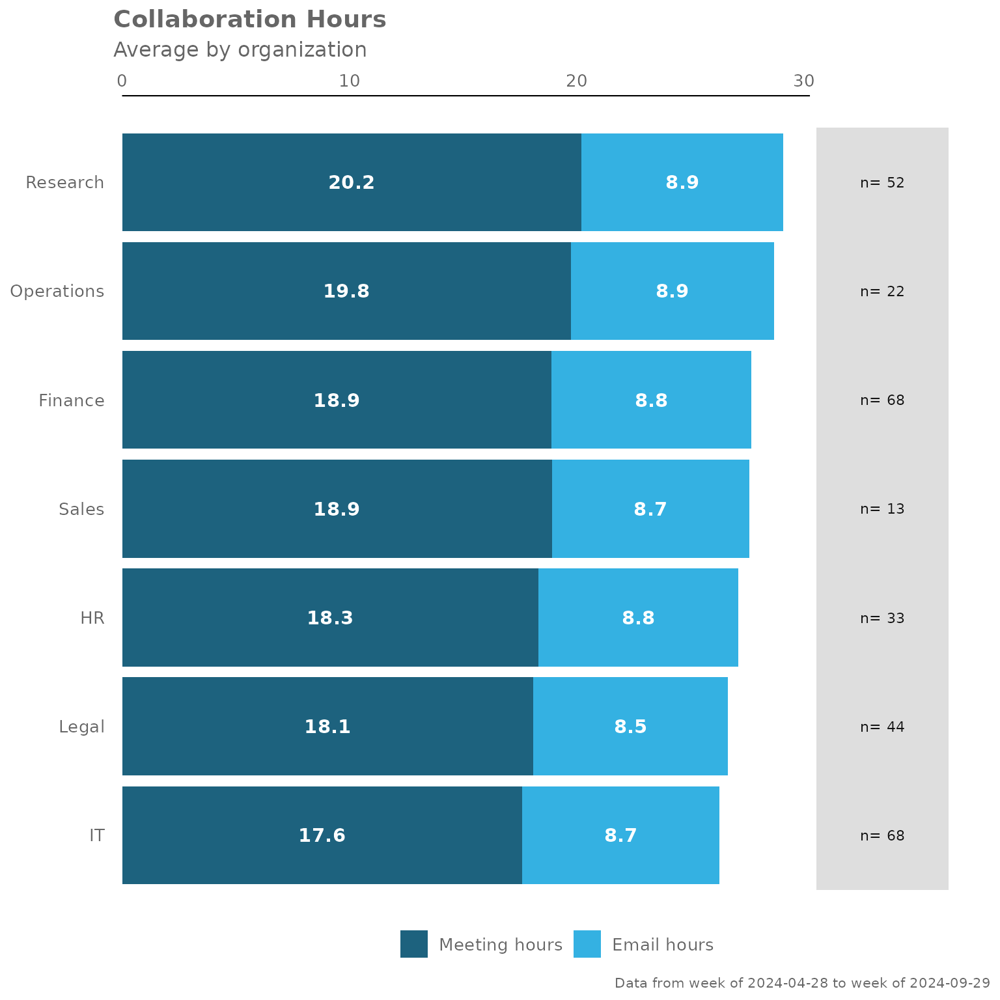
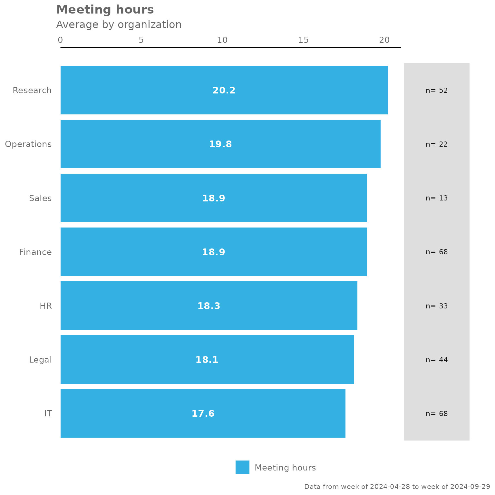
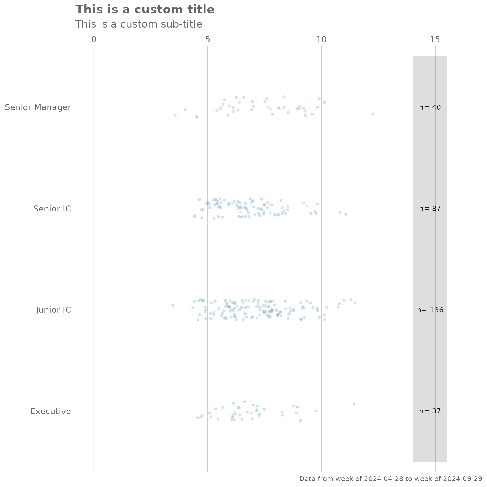

# Introduction to {vivainsights}

## Background

This document walks through the **vivainsights** package, and provides
some examples on how to use some of the functions. For our full online
documentation for the package, please visit
<https://microsoft.github.io/vivainsights/>. For anything else related
to Viva Insights, please visit
<https://learn.microsoft.com/en-us/viva/insights/>.

### Setting up

To start off using **vivainsights**, you’ll have to load it by running
[`library(vivainsights)`](https://microsoft.github.io/vivainsights/).
For the purpose of our examples, let’s also load **dplyr** as a
component package of **tidyverse** (alternatively, you can just run
[`library(tidyverse)`](https://tidyverse.tidyverse.org)):

``` r
library(vivainsights)
library(dplyr)
```

The package ships with a standard Person query dataset `pq_data`:

``` r
data("pq_data") # Person Query data

# Check what the first ten columns look like
pq_data %>%
  .[,1:10] %>%
  glimpse()
#> Rows: 6,900
#> Columns: 10
#> $ PersonId                       <chr> "7d99f98f-c0a6-4df9-b2c3-ec9507caf781",…
#> $ MetricDate                     <date> 2024-04-28, 2024-04-28, 2024-04-28, 20…
#> $ Collaboration_hours            <dbl> 14.12876, 26.04322, 25.72919, 13.81522,…
#> $ Copilot_actions_taken_in_Teams <int> 5, 7, 7, 4, 5, 5, 4, 3, 4, 4, 3, 3, 6, …
#> $ Meeting_and_call_hours         <dbl> 6.592511, 17.928541, 18.803317, 9.35010…
#> $ Internal_network_size          <int> 63, 132, 140, 61, 70, 125, 54, 138, 104…
#> $ Email_hours                    <dbl> 5.612346, 10.767665, 10.338308, 5.25528…
#> $ Channel_message_posts          <dbl> 0.9268549, 0.2193999, 0.4485522, 1.7859…
#> $ Conflicting_meeting_hours      <dbl> 2.5896529, 4.6029578, 5.0193866, 1.1122…
#> $ Large_and_long_meeting_hours   <dbl> 0.00000000, 0.00000000, 1.85827223, 1.5…
```

------------------------------------------------------------------------

## Example Analysis

### Collaboration Summary

The
[`collaboration_summary()`](https://microsoft.github.io/vivainsights/reference/collaboration_sum.md)
function allows you to generate a stacked bar plot summarising the email
and meeting hours by an HR attribute you specify:

``` r
pq_data %>% collaboration_summary(hrvar = "LevelDesignation")
```


By changing the `hrvar()` argument, you can change the data being shown
easily:

``` r
pq_data %>% collaboration_summary(hrvar = "Organization")
```



The
[`collaboration_summary()`](https://microsoft.github.io/vivainsights/reference/collaboration_sum.md)
function also comes with an option to return summary tables, rather than
plots. Just specify “table” in the `return` argument:

``` r
pq_data %>% collaboration_summary(hrvar = "LevelDesignation", return = "table")
#> # A tibble: 4 × 5
#>   group          Meeting_hours Email_hours Total Employee_Count
#>   <chr>                  <dbl>       <dbl> <dbl>          <int>
#> 1 Executive               18.4        8.83  27.3             37
#> 2 Junior IC               18.2        8.72  27.0            136
#> 3 Senior IC               19.4        8.82  28.2             87
#> 4 Senior Manager          19.2        8.70  27.9             40
```

------------------------------------------------------------------------

### Summary of Key Metrics

The
[`keymetrics_scan()`](https://microsoft.github.io/vivainsights/reference/keymetrics_scan.md)
function allows you to produce summary metrics from the Person Query
data. Similar to most of the functions in this package, you can specify
what output to return with the `return` argument. In addition, you have
to specify which HR attribute/variable to use as a grouping variable
with the `hrvar` argument.

There are two valid return values for
[`keymetrics_scan()`](https://microsoft.github.io/vivainsights/reference/keymetrics_scan.md):

- Heat map (`return = "plot"`)
- Summary table (`return = "table"`)

And here are what the outputs look like.

Heatmap:

``` r
pq_data %>% keymetrics_scan(hrvar = "Organization", return = "plot")
#> Warning: Using `size` aesthetic for lines was deprecated in ggplot2 3.4.0.
#> ℹ Please use `linewidth` instead.
#> ℹ The deprecated feature was likely used in the vivainsights package.
#>   Please report the issue at
#>   <https://github.com/microsoft/vivainsights/issues/>.
#> This warning is displayed once per session.
#> Call `lifecycle::last_lifecycle_warnings()` to see where this warning was
#> generated.
```


Summary table:

``` r
pq_data %>% keymetrics_scan(hrvar = "Organization", return = "table")
#> # A tibble: 12 × 8
#>    variable          Finance      HR      IT   Legal Operations Research   Sales
#>    <fct>               <dbl>   <dbl>   <dbl>   <dbl>      <dbl>    <dbl>   <dbl>
#>  1 Collaboration_sp…  34.0    34.3    34.0    34.2       33.7     34.2    33.6  
#>  2 Collaboration_ho…  23.1    23.1    22.8    22.5       23.5     23.3    23.1  
#>  3 After_hours_coll…   6.81    6.66    6.92    7.01       7.66     7.51    7.58 
#>  4 Meetings           16.6    16.5    16.5    16.3       16.9     17.0    16.7  
#>  5 Meeting_hours      18.9    18.3    17.6    18.1       19.8     20.2    18.9  
#>  6 Meeting_and_call…   0.895   0.860   0.864   0.883      0.874    0.907   0.924
#>  7 Meeting_and_call…  12.2    12.0    11.8    12.3       12.6     12.6    12.6  
#>  8 Emails_sent        44.0    44.2    43.7    43.2       44.8     44.8    43.4  
#>  9 Email_hours         8.79    8.80    8.70    8.55       8.92     8.89    8.70 
#> 10 Internal_network… 123.    123.    121.    119.       126.     125.    123.   
#> 11 External_network…  32.3    32.4    32.0    31.0       33.0     33.2    32.1  
#> 12 Employee_Count     68      33      68      44         22       52      13
```

------------------------------------------------------------------------

## Meeting Habits

The
[`meeting_summary()`](https://microsoft.github.io/vivainsights/reference/meeting_summary.md)
provides a very similar output to the previous functions, but focuses on
meeting habit data. Again, the input data is the Person Query, and you
will need to specify an HR attribute/variable to use as a grouping
variable with the `hrvar` argument.

There are two valid return values for
[`meeting_summary()`](https://microsoft.github.io/vivainsights/reference/meeting_summary.md):

- Heat map (`return = "plot"`)
- Summary table (`return = "table"`)

> The idea is that functions in this package will share a consistent
> design, and the required arguments and outputs will be what users
> ‘expect’ as they explore the package. The benefit of this is to
> improve ease of use and adoption.

And here are what the outputs look like, for
[`meeting_summary()`](https://microsoft.github.io/vivainsights/reference/meeting_summary.md).

Heatmap:

``` r
pq_data %>% meeting_summary(hrvar = "Organization", return = "plot")
```



Summary table:

``` r
pq_data %>% meeting_summary(hrvar = "Organization", return = "table")
#> # A tibble: 7 × 3
#>   group      Meeting_hours     n
#>   <chr>              <dbl> <int>
#> 1 Finance             18.9    68
#> 2 HR                  18.3    33
#> 3 IT                  17.6    68
#> 4 Legal               18.1    44
#> 5 Operations          19.8    22
#> 6 Research            20.2    52
#> 7 Sales               18.9    13
```

------------------------------------------------------------------------

### Customizing plot outputs

With a few rare exceptions, the majority of plot outputs returned by
**vivainsights** functions are ggplot outputs. What this means is that
there is a lot of flexibility in adding or overriding visual elements in
the plots. For instance, you can take the following ‘fizzy drink’
(jittered scatter) plot:

``` r
pq_data %>%
  afterhours_fizz(hrvar = "LevelDesignation", return = "plot")
```


… and add custom titles, subtitles, and flip the axes by adding ggplot
layers:

``` r
library(ggplot2) # Requires ggplot2 for customizations

pq_data %>%
  afterhours_fizz(hrvar = "LevelDesignation", return = "plot") +
  labs(title = "This is a custom title",
       subtitle = "This is a custom sub-title") +
  coord_flip() # Flip coordinates
#> Coordinate system already present.
#> ℹ Adding new coordinate system, which will replace the existing one.
```



Note that the “pipe” syntax changes from `%>%` to `+` once you are
manipulating a ggplot output, which will return an error if not used
correctly.

Adding customized elements may ‘break’ the visualization, so please
exercise caution when doing so.

For more information on ggplot, please visit
<https://ggplot2.tidyverse.org/>.

------------------------------------------------------------------------

## Feedback

Hope you found this useful! If you have any suggestions or feedback,
please log them at <https://github.com/microsoft/vivainsights/issues/>.
