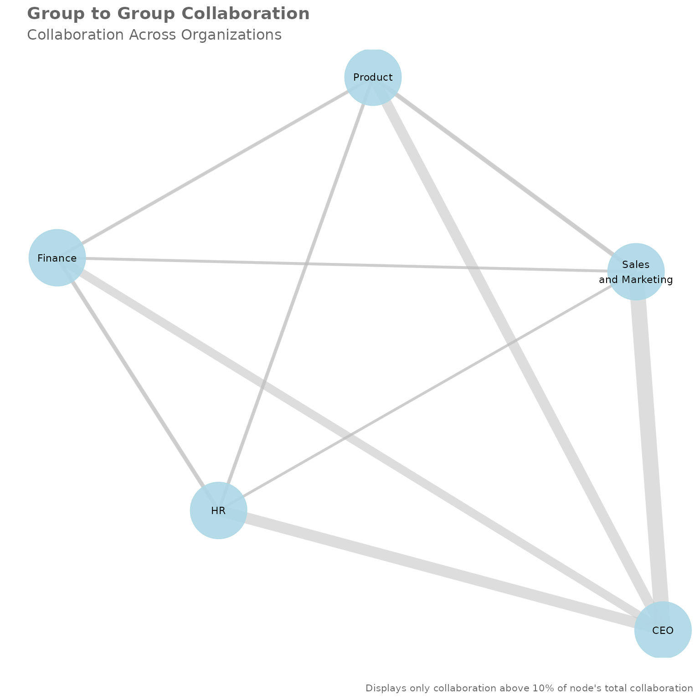
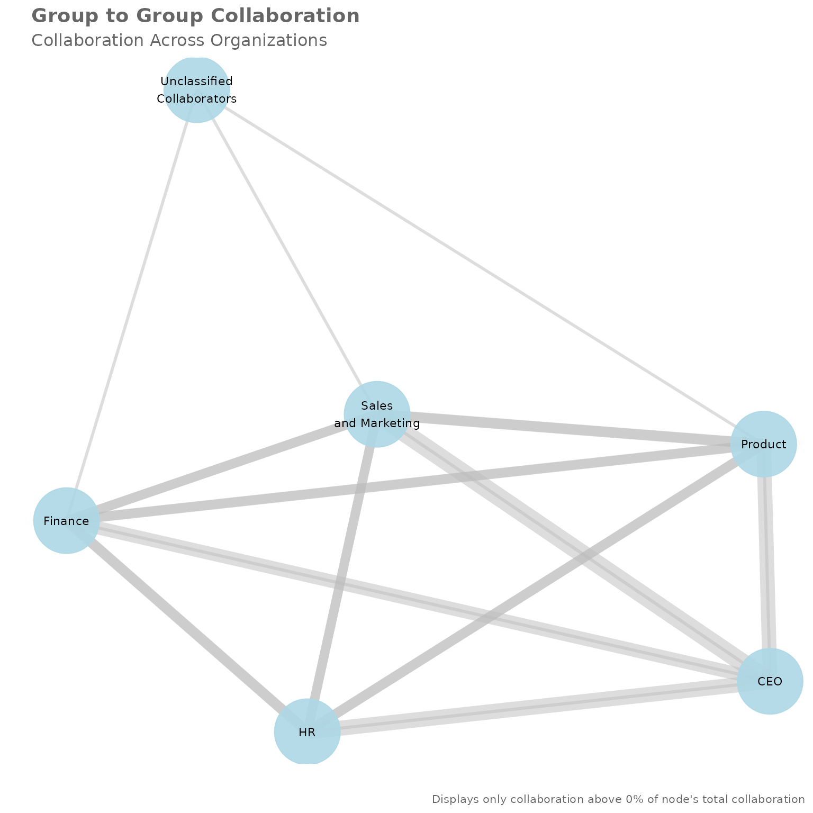
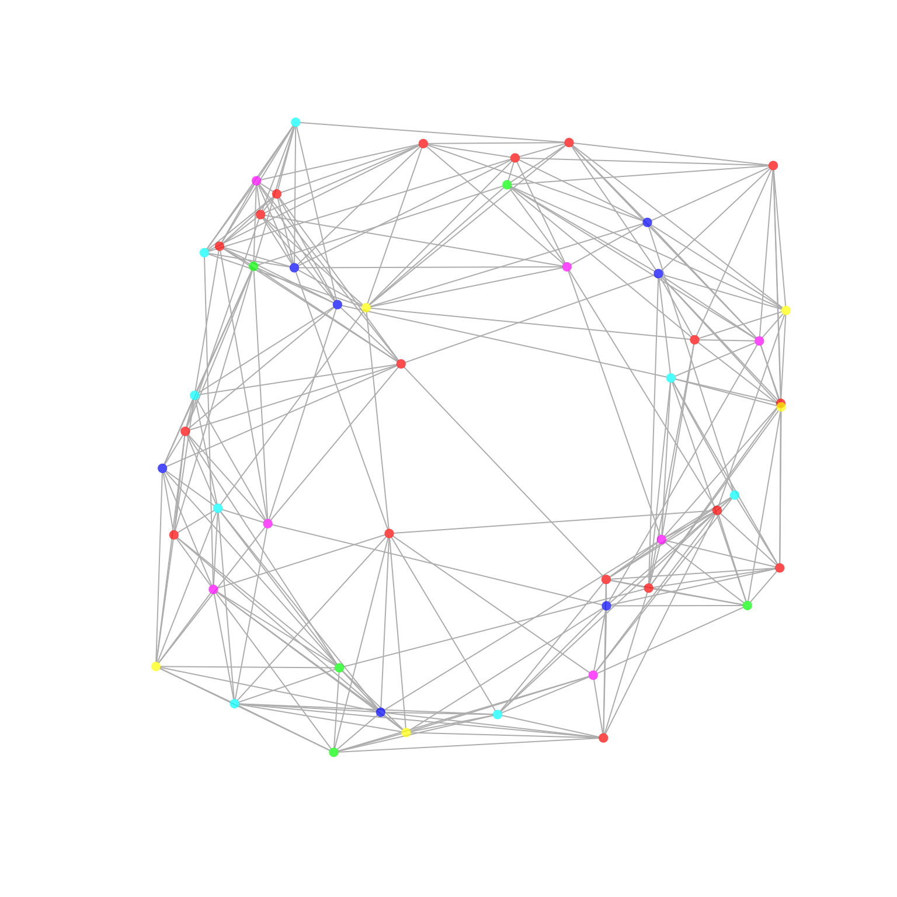

# Introduction to Organizational Network Analysis with vivainsights in R

This article provides a beginner’s introduction to Organizational
Network Analysis (ONA), its basic concepts, and how to run them with the
functions available from the [**vivainsights** R
library](https://microsoft.github.io/vivainsights/). We will address the
following questions in this article:

- What is Organizational Network Analysis (ONA)?
- What are the basic building blocks of networks?
- What are the scenarios where ONA can be applied?
- What are the functions and outputs available in the **vivainsights** R
  library?

This is an updated version of the [original
article](https://microsoft.github.io/wpa/articles/network-analysis.html)
published for the legacy **wpa** library in 2021 August.

## Introduction

**Organizational Network Analysis (ONA)** is a family of methods to
understand patterns of collaboration by examining the strength,
frequency and nature of interactions between people. Analyzing and
visualizing network connectivity in your organization can help you shape
business strategy that unlocks success for individual and team
productivity, innovation, employee engagement and organizational change,
thereby helping your business become more resilient and effective.

Most valuable information in organizations is not codified. As employees
collaborate, information flows from one person to the other or they
generate knowledge together. These connections deliver value when
information is exchanged and visualizing these relationships can provide
us with a holistic view of how information flows through an
organization. ONA can help us reveal central network collaborators,
critical connections, and potential barriers to information flow.

### Basic Building Blocks

We will start with the basic building blocks of networks. Networks
consist of two primary aspects, a multitude of separate entities
(“nodes”) and the connections between them (“edges”). Nodes and edges
provide a foundation for understanding how information flows in your
organization, and also strategizing on how they can flow and should
flow. Nodes in ONA visualizations typically represent individual
employees or groups of employees (e.g. `Organization`, `Region` etc.),
serving as important hubs for the exchange of ideas and information. In
addition to these nodes, you have connections between them called
**edges**. These edges represent a connection between nodes, which in
turn represents a collaboration relationship between individuals or
groups. In the context of Viva Insights, these connections between nodes
in the network represent collaboration activities (emails, meetings,
calls, instant messages). In a network analysis, we also need to
understand the strength of the tie. For this calculation we are using
time spent together in collaboration. In addition, we have to consider
the **direction** in which collaboration is operated. For meetings there
is no direction, but for emails, chats and calls we have a sense of
direction which we can look at.

> Viva Insights provides a powerful data source for performing network
> analysis and for surfacing insights about information flows in your
> organization. The **vivainsights** R library contains several powerful
> features that enables you to create such analysis and visualizations.

## Scenarios

Network analysis provides a data-driven approach to address
organizational challenges. Practical scenarios include:

- **Identifying silos**: ONA can help reveal critical silos where
  collaboration improvements can be generated. By tapping into this
  data, organizations can rebalance collaboration loads, expand
  capacity, and integrate expertise on the edge of the network to break
  down those silos.
- **Identifying influencers**: By understanding the depth and intensity
  of collaboration, organizations can identify influencers. To boost
  employee engagement and prevent potential attrition, they can reduce
  collaborative overload on those central collaborators in the network
  and better leverage top talent.
- **Workspace planning**: ONA can surface the ‘organic’ patterns of how
  individuals and groups collaborate with each other, and help
  decision-makers determine how workspaces and seating should be
  allocated as organizations move back to the office.
- **Improve organizational culture**: Through insights into where
  information flows efficiently and flags where it flows inefficiently,
  this approach offers a great opportunity to reduce effort and improve
  value creation. With this information, key work activities can be
  enhanced, innovation can be driven, and network behaviour can be
  aligned to organizational strategies.

## Functions and Metrics

Network analysis is quantitative and uses collaboration data to create a
matrix of relationships and applies matrix algebra to calculate
measures. The **vivainsights** R package provides a set of functions
that are designed to run these analyses and visualizations with the data
from Viva Insights. Specifically, the data refers to two
cross-collaboration queries, the [Group-to-group
query](https://learn.microsoft.com/en-us/viva/insights/advanced/analyst/cross-collaboration-g2g)
and the [Person-to-person
query](https://learn.microsoft.com/en-us/viva/insights/advanced/analyst/cross-collaboration-p2p).

1.  **Group-to-group query**: captures collaboration between two groups
    in your organisation. For example, how often employees in design
    collaborate with US-based employees.
2.  **Person-to-person query**: captures collaboration between
    individuals in your organisation. For example, how strongly managers
    in engineering are connected to managers in design.

The corresponding functions from the package are as follows:

1.  [`network_g2g()`](https://microsoft.github.io/vivainsights/reference/network_g2g.html):
    an advanced function which manipulates a group-to-group
    collaboration graph. It creates a network plot with the
    group-to-group query and displays collaboration across your
    organization. The default metric value is
    `Group_collaboration_time_invested`, but this can be customized by
    supplying the name of the metric.

2.  [`network_p2p()`](https://microsoft.github.io/vivainsights/reference/network_p2p.html):
    this function analyses a person-to-person (P2P) network query, with
    multiple visualisation and analysis output options (e.g. sankey
    plot, network plot). This function enables you to perform community
    detection as well as compute centrality statistics on the P2P
    network. \> Strong and diverse tie metrics are based on
    collaboration activities and indicates how varied, broad and strong
    a person’s connections or engagements are. See more from
    [here](https://learn.microsoft.com/en-us/viva/insights/advanced/reference/metrics).

## Queries and Outputs

The functions from the **vivainsights** library operate on top of
queries generated from the Viva Insights Analyst experience. These
queries are first generated, exported as CSV, and loaded into R as
`data.frame` objects. These data frames are then passed into the
functions as input parameters.

Another parameter that can be specified is the `return` parameter, which
for instance controls whether the function would return a table
(`return = "table"`) or a plot (`return = "plot"`).

### Group-to-group

Here is an example of the
[`network_g2g()`](https://microsoft.github.io/vivainsights/reference/network_g2g.md)
function run on the `g2g_data` data frame, with the `return` parameter
set to `"plot"`.

``` r
network_g2g(data = g2g_data, return = "plot")
```



- You can specify the metric being used for this visualization (Default:
  metric = “Group_collaboration_time_invested”)
- Optionally you can provide a data frame that displays the size of each
  organization in the collaborator attribute. More information find
  [here](https://microsoft.github.io/vivainsights/reference/network_g2g.html).

*Interpretation: This visualization shows how strongly different
organizations are connected. Each node represents a group in an
organization, and the width of the edges represent the proportion of
collaboration that occurs between the two groups. Note that an exclusion
threshold is applied here, so that only collaboration proportions (edge
widths) above a specified percentage are shown. Groups or nodes that do
not have any edges connected to them (‘islands’) may have a possible
risk of being siloed because they are not as strongly connected to other
groups.*

To display all the edges without setting an exclusion threshold, you can
run:

``` r
network_g2g(data = g2g_data, exc_threshold = 0, return = "plot")
```



To better understand the data, you can also run the following code to
return a table of the data:

To validate hypotheses and better understand the data, it is also
recommended that you run the following code to examine the interaction
matrix. The interaction matrix is a matrix that captures the aggregated
collaboration between all groups against each other, in the scope of the
generated query.

``` r
network_g2g(data = g2g_data, exc_threshold = 0, return = "table")
#> # A tibble: 5 × 7
#>   PrimaryOrg          Finance    HR Product `Sales and Marketing`      CEO
#>   <chr>                 <dbl> <dbl>   <dbl>                 <dbl>    <dbl>
#> 1 CEO                   0.210 0.247   0.236                 0.307 NA      
#> 2 Finance               0.570 0.152   0.142                 0.133  0.00278
#> 3 HR                    0.143 0.584   0.141                 0.129  0.00308
#> 4 Product               0.132 0.137   0.582                 0.146  0.00320
#> 5 Sales and Marketing   0.132 0.130   0.158                 0.576  0.00385
#> # ℹ 1 more variable: `Unclassified Collaborators` <dbl>
```

### Person-to-person

Running the network visualization for the Person-to-person query is
similar. In the code below, we start off by generating a
person-to-person data frame using the
[`p2p_data_sim()`](https://microsoft.github.io/vivainsights/reference/p2p_data_sim.md)
function. This function generates a simulated data frame that is
compatible with the
[`network_p2p()`](https://microsoft.github.io/vivainsights/reference/network_p2p.md)
function. Next, we run the
[`network_p2p()`](https://microsoft.github.io/vivainsights/reference/network_p2p.md)
function and specify the `return` parameter to be `"plot"`.

``` r
p2p_data <- p2p_data_sim(size = 50)

p2p_data %>% network_p2p(hrvar = 'Organization', return = "plot")
```



Each node represents an individual, and the colour of the nodes
correspond to the HR attribute specified in the arguments
(‘Organization’). An edge represents there being a reciprocal
interaction between two individuals. By default, multi-dimensionality
scaling (`layout = 'mds'`) is used for determining the layout of the
network.

### Centrality

One additional functionality of
[`network_p2p()`](https://microsoft.github.io/vivainsights/reference/network_p2p.md)
is the ability to generate centrality statistics. Centrality statistics
are a set of metrics that are used to identify the most important nodes
in a network. The following code generates a centrality table, which is
a table of centrality statistics for each node in the network.

``` r
tb_centrality <- p2p_data %>%
   network_p2p(
      hrvar = 'Organization',
      centrality = 'degree',
      return = "data"
      )

head(tb_centrality)
#> # A tibble: 6 × 7
#>   name     Organization betweenness closeness degree eigenvector pagerank
#>   <chr>    <chr>              <dbl>     <dbl>  <dbl>       <dbl>    <dbl>
#> 1 SIM_ID_1 Org F               0        0.345     10       0.781  0.00456
#> 2 SIM_ID_2 Org F               0        0.421     10       0.809  0.00456
#> 3 SIM_ID_3 Org E               3.06     0.346     10       0.825  0.00534
#> 4 SIM_ID_4 Org D               3.22     0.338     10       0.841  0.00591
#> 5 SIM_ID_5 Org C              39.5      0.398     11       0.938  0.00662
#> 6 SIM_ID_6 Org B              36.6      0.383     12       1      0.00743
```

It is also possible to run the above, averaged by an attribute specified
with the `hrvar` argument:

``` r
p2p_data %>% network_p2p(hrvar = 'Organization', centrality = 'degree', return = "table")
#> # A tibble: 6 × 7
#>   Organization     n betweenness closeness degree eigenvector pagerank
#>   <chr>        <int>       <dbl>     <dbl>  <dbl>       <dbl>    <dbl>
#> 1 Org A            7        42.4     0.563  10.1        0.720   0.0217
#> 2 Org B            7        41.3     0.515  10.4        0.741   0.0189
#> 3 Org C            8        31.8     0.486   9.5        0.712   0.0243
#> 4 Org D            5        36.8     0.496  10.2        0.765   0.0163
#> 5 Org E            5        34.0     0.461  10          0.719   0.0155
#> 6 Org F           18        32.3     0.512   9.94       0.691   0.0201
```

The definition of the centrality metrics are as follows:

- **betweenness**: number of shortest paths going through a node.
- **closeness**: number of steps required to access every other node
  from a given node.
- **degree**: number of connections linked to a node.
- **eigenvector**: a measure of the influence a node has on a network.
- **pagerank**: calculates the PageRank for the specified vertices.
  Please refer to the igraph package documentation for the detailed
  technical definition.

### Communities

In the context of ONA, **community detection** refers to the process of
identifying groups of nodes (in this case, individuals within an
organization) that are more densely connected with each other than with
the rest of the network. These groups, or communities, often reveal
substructures within the organization, such as informal groups or teams
that collaborate across department, job roles, or geographical
boundaries.

Community detection can provide valuable insights into the structure and
dynamics of an organization. For example, it can help identify silos
within the organization, where information or resources might not be
flowing efficiently. It can also help identify key individuals who serve
as bridges between different communities, who could be leveraged to
improve communication and collaboration across the organization.

You can use the `community` and the `comm_args` argument in
[`network_p2p()`](https://microsoft.github.io/vivainsights/reference/network_p2p.md)
to perform community detection. Here is an example where we also specify
the function to use the “ggraph” style:

``` r
network_p2p(
   data = p2p_data,
   community = "leiden",
   style = "ggraph",
   comm_args = list("resolution" = 0.1)
   )
```


Here, we are using the [Leiden
algorithm](https://igraph.org/r/doc/cluster_leiden.html) to detect
communities. The `resolution` parameter is a tuning parameter that
controls the size of the communities. A higher value of `resolution`
will result in smaller (and more) communities.
[`network_p2p()`](https://microsoft.github.io/vivainsights/reference/network_p2p.md)
operates on top of the community detection algorithms offered by
[igraph](https://igraph.org/r/) package, with the following algorithms
supported:

- **leiden**
  ([`igraph::cluster_leiden()`](https://r.igraph.org/reference/cluster_leiden.html)):
  Leiden algorithm of Traag, van Eck, & Waltman
- **walktrap**
  ([`igraph::cluster_walktrap()`](https://r.igraph.org/reference/cluster_walktrap.html)):
  Walktrap community finding algorithm using short random walks, of Pons
  and Latapy
- **fast_greedy**
  ([`igraph::cluster_fast_greedy()`](https://r.igraph.org/reference/cluster_fast_greedy.html)):
  Fast greedy modularity optimization, of Clauset, Newman, & Moore
- **edge_betweenness**
  ([`igraph::cluster_edge_betweenness()`](https://r.igraph.org/reference/cluster_edge_betweenness.html)):
  Edge betweenness community finding algorithm, of Girvan & Newman
- **infomap**
  ([`igraph::cluster_infomap()`](https://r.igraph.org/reference/cluster_infomap.html)):
  Infomap community finding algorithm, of Rosvall & Bergstrom
- **label_prop**
  ([`igraph::cluster_label_prop()`](https://r.igraph.org/reference/cluster_label_prop.html)):
  Label propagation community finding algorithm, of Raghavan, Albert, &
  Kumara
- **leading_eigen**
  ([`igraph::cluster_leading_eigen()`](https://r.igraph.org/reference/cluster_leading_eigen.html)):
  Leading eigenvector community finding algorithm, of Newman
- **multilevel** (`igraph::cluster_multilevel()`): Multilevel community
  finding algorithm, of Blondel et al.
- **spinglass**
  ([`igraph::cluster_spinglass()`](https://r.igraph.org/reference/cluster_spinglass.html)):
  Spinglass community finding algorithm, of Reichardt & Bornholdt

Here is another example of how to use a different community detection
algorithm:

``` r
network_p2p(
  data = p2p_data,
  style = "ggraph",
  community = "fluid_communities",
  comm_args = list("no.of.communities" = 5)
)
```


Please see the [original igraph
documentation](https://igraph.org/r/doc/) for more details on the
community detection parameters to pass into `comm_args`.

You can also choose to visualize and explore the communities using other
options available in `return`. For instance, you can return a sankey
visual:

``` r
network_p2p(
  data = p2p_data,
  community = "leiden",
  return = "sankey",
  comm_args = list("resolution" = 0.1)
)
```

Or a table of the communities, and how they group together with the HR
attribute specified in `hrvar`:

``` r
network_p2p(
  data = p2p_data,
  community = "leiden",
  return = "table",
  comm_args = list("resolution" = 0.1)
)
#> # A tibble: 18 × 3
#>    Organization cluster     n
#>    <chr>        <chr>   <int>
#>  1 Org A        1           2
#>  2 Org A        2           3
#>  3 Org A        3           2
#>  4 Org B        1           2
#>  5 Org B        2           2
#>  6 Org B        3           3
#>  7 Org C        1           3
#>  8 Org C        2           3
#>  9 Org C        3           2
#> 10 Org D        1           2
#> 11 Org D        2           1
#> 12 Org D        3           2
#> 13 Org E        1           2
#> 14 Org E        2           1
#> 15 Org E        3           2
#> 16 Org F        1           3
#> 17 Org F        2           7
#> 18 Org F        3           8
```

## Analysis Approach

> The best practice towards network analysis is always to first
> establish and validate hypotheses with the data, and *then* visualize
> the result. The reason why one should not start an analysis by
> interpreting a network visual is that network visualizations are
> critically affected by inputs such as layout algorithms (of which many
> are non-deterministic), inputs to those layout algorithms, and visual
> elements such as the colours and transparencies of the nodes and
> edges.

The above point on best practice is particularly pertinent for
person-to-person analyses, which typically involve a large number of
nodes and misleading conclusions can be drawn if one is not fully aware
of the input parameters that have been used in generating the visual. In
this case, the recommend interpretative approach would be to:

1.  Run the summary tables or graph statistics by returning `'table'` or
    `'network'`, making use of graph analysis functions that are
    compatible with an `'igraph'` object.

2.  Develop a series of hypotheses based on your knowledge of the
    organization and the data you are seeing. For instance, the
    hypothesis could be that Team A and Team B have very few ties with
    each other, but Region C maintain very strong ties with both of
    those regions, making it potentially a less optimal solution to
    allocate Team A and B together on ‘office day’ rotations. The same
    principle applies when generating communities.

3.  Validate hypothesis with the data, using multiple permutations. For
    instance, the selected date range and population could lead to a
    different outcome in the data.

    Iterate with input parameters to create the visual that is most
    appropriate for communicating your analysis.

## End Note & Reference

This article is a first introduction to the topic of Organizational
Network Analysis but there is more to come. At this point you should
know the basic building blocks of network analysis and how to run the
relevant functions in the **vivainsights** R library. Here are some more
references on how to use the **vivainsights** R package and the topic of
networks:

- [Overview of functions of the vivainsights R
  package](https://microsoft.github.io/vivainsights/reference/index.html)
- [Handbook of Graphs and Networks in People
  Analytics](https://ona-book.org/index.html)
