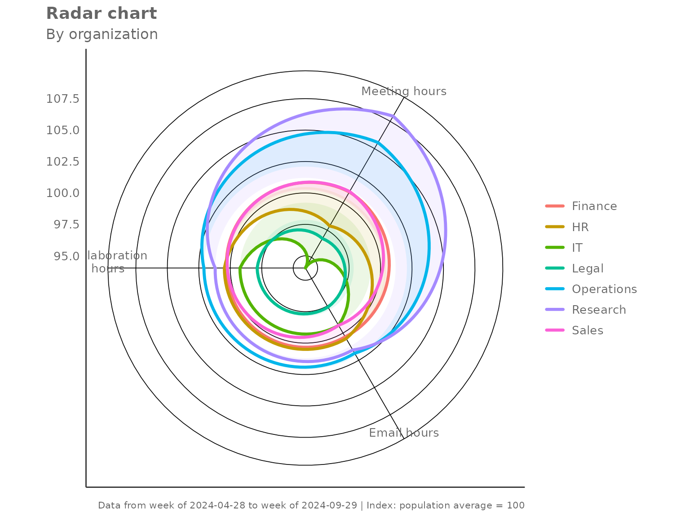
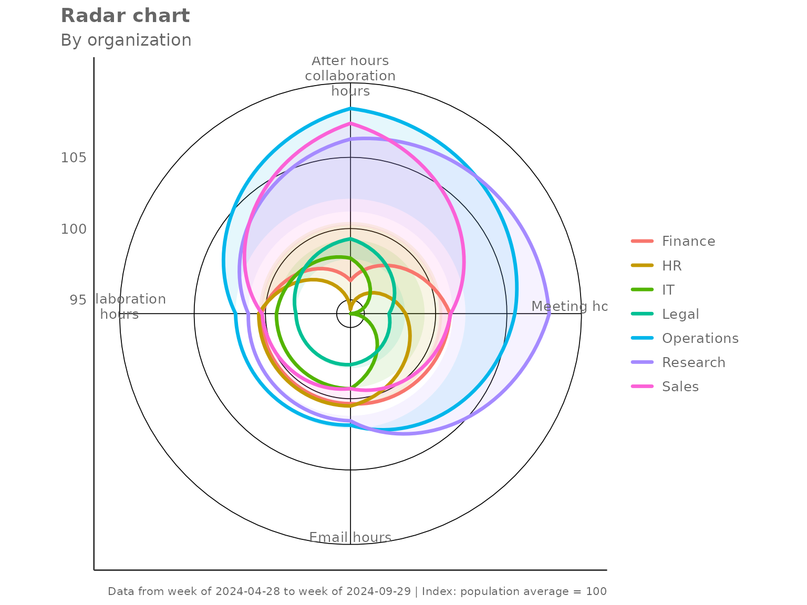
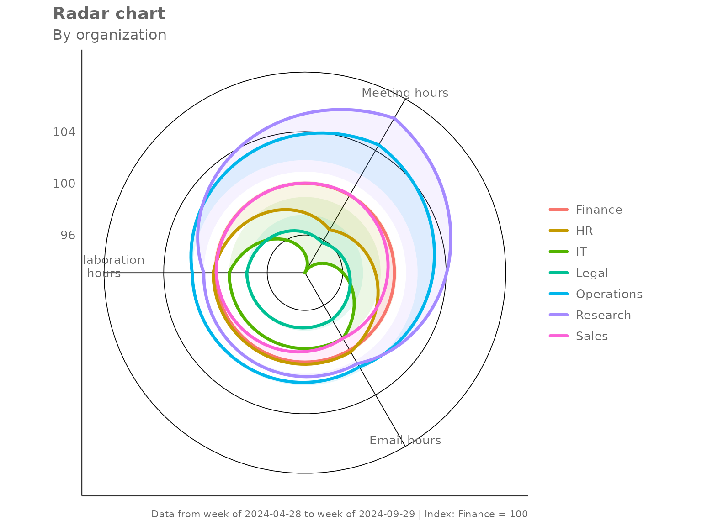
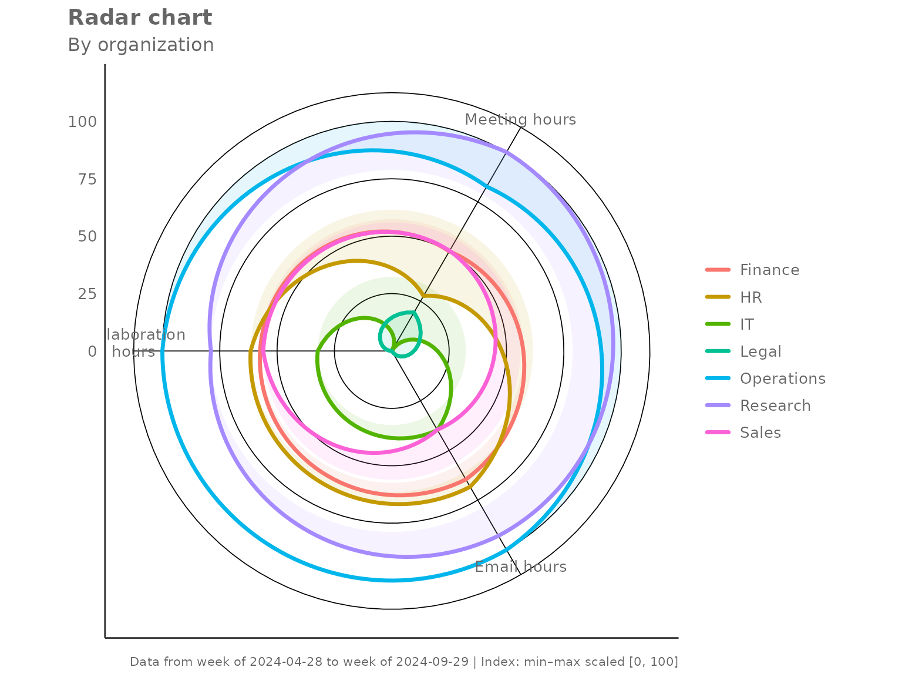
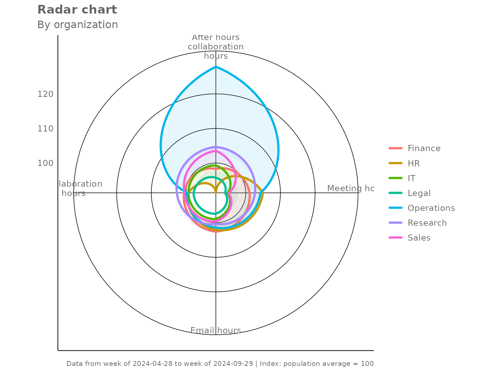
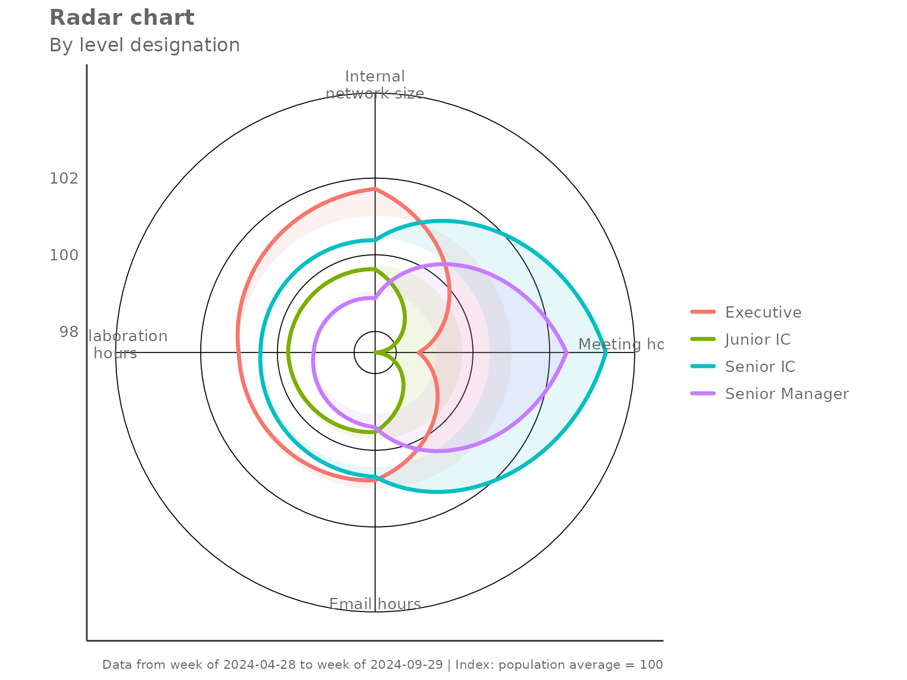
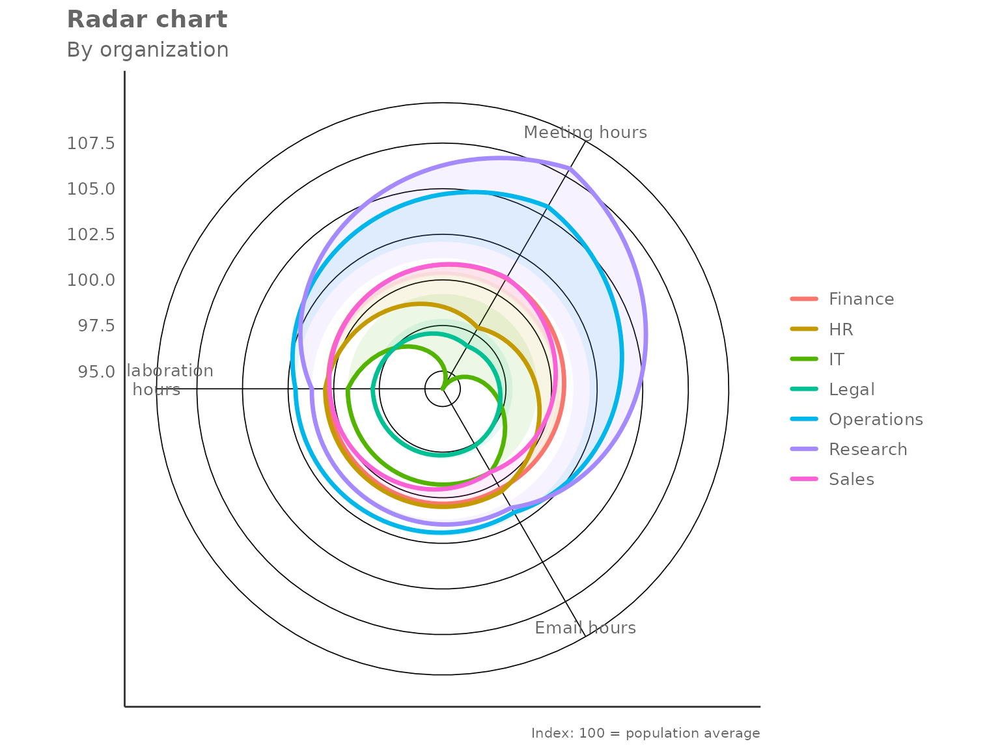

# Radar Charts with create_radar()

``` r
library(vivainsights)
library(dplyr)
```

## Overview

[`create_radar()`](https://microsoft.github.io/vivainsights/reference/create_radar.md)
produces a multi-group radar (spider) chart that compares several
metrics simultaneously across different segments of your workforce. The
key steps inside the function are:

1.  **Person-level aggregation** — averages (or medians) each metric per
    person per group.
2.  **Group-level aggregation** — summarises person-level values to one
    row per group.
3.  **Privacy filtering** — drops groups below `mingroup` unique
    persons.
4.  **Optional indexing** — rescales values so groups are easy to
    compare.

------------------------------------------------------------------------

## Basic usage

Pass a data frame, a character vector of metric columns, and a grouping
column. By default the chart indexes each metric so that the overall
population mean equals 100.

``` r
create_radar(
  data    = pq_data,
  metrics = c("Collaboration_hours", "Email_hours", "Meeting_hours"),
  hrvar   = "Organization",
  mingroup = 5
)
```



Each polygon represents one group. A value of 100 on any axis means that
group sits exactly at the population average for that metric; values
above 100 indicate above-average activity and values below 100 indicate
below-average activity.

### Returning the underlying table

Set `return = "table"` to get the indexed values as a data frame
instead:

``` r
radar_tbl <- create_radar(
  data    = pq_data,
  metrics = c("Collaboration_hours", "Email_hours", "Meeting_hours"),
  hrvar   = "Organization",
  mingroup = 5,
  return  = "table"
)

radar_tbl
#> # A tibble: 7 × 5
#>   Organization Collaboration_hours Email_hours Meeting_hours     n
#>   <chr>                      <dbl>       <dbl>         <dbl> <int>
#> 1 Finance                    100.        100.          101.     68
#> 2 HR                         100.        101.           97.9    33
#> 3 IT                          99.2        99.3          94.0    68
#> 4 Legal                       97.9        97.6          96.7    44
#> 5 Operations                 102.        102.          106.     22
#> 6 Research                   101.        102.          108.     52
#> 7 Sales                      100.         99.3         101.     13
```

The `n` column records the number of unique persons in each group —
useful for checking which groups are close to the privacy threshold.

------------------------------------------------------------------------

## Indexing modes

The `index_mode` parameter controls how metric values are rescaled
before plotting.

### `"total"` (default)

Each metric is divided by the overall population mean and multiplied by
100. A group at 100 matches the average.

``` r
create_radar(
  data       = pq_data,
  metrics    = c("Collaboration_hours", "Email_hours",
                 "Meeting_hours", "After_hours_collaboration_hours"),
  hrvar      = "Organization",
  mingroup   = 5,
  index_mode = "total"
)
```



### `"ref_group"` — benchmark against one group

Set `index_ref_group` to the name of the group that should equal 100 on
every axis. All other groups are expressed relative to it.

``` r
create_radar(
  data            = pq_data,
  metrics         = c("Collaboration_hours", "Email_hours", "Meeting_hours"),
  hrvar           = "Organization",
  mingroup        = 5,
  index_mode      = "ref_group",
  index_ref_group = "Finance"
)
```



### `"minmax"` — relative spread within observed groups

Each metric is scaled so the lowest group maps to 0 and the highest to
100. This maximises visual contrast and is useful when absolute levels
matter less than which group is highest or lowest.

``` r
create_radar(
  data       = pq_data,
  metrics    = c("Collaboration_hours", "Email_hours", "Meeting_hours"),
  hrvar      = "Organization",
  mingroup   = 5,
  index_mode = "minmax"
)
```



### `"none"` — raw group values

No rescaling is applied. The axes carry the original units, which makes
cross-metric comparison harder but preserves the absolute magnitude.

``` r
create_radar(
  data       = pq_data,
  metrics    = c("Collaboration_hours", "Email_hours", "Meeting_hours"),
  hrvar      = "Organization",
  mingroup   = 5,
  index_mode = "none",
  return     = "table"
)
#> # A tibble: 7 × 5
#>   Organization Collaboration_hours Email_hours Meeting_hours     n
#>   <chr>                      <dbl>       <dbl>         <dbl> <int>
#> 1 Finance                     23.1        8.79          18.9    68
#> 2 HR                          23.1        8.80          18.3    33
#> 3 IT                          22.8        8.70          17.6    68
#> 4 Legal                       22.5        8.55          18.1    44
#> 5 Operations                  23.5        8.92          19.8    22
#> 6 Research                    23.3        8.89          20.2    52
#> 7 Sales                       23.1        8.70          18.9    13
```

------------------------------------------------------------------------

## Aggregation method

The default two-step aggregation uses the **mean** at both the person
level and the group level. Switch to `agg = "median"` for robustness
against outliers.

``` r
create_radar(
  data     = pq_data,
  metrics  = c("Collaboration_hours", "Email_hours",
               "Meeting_hours", "After_hours_collaboration_hours"),
  hrvar    = "Organization",
  mingroup = 5,
  agg      = "median"
)
```



------------------------------------------------------------------------

## Grouping by a different HR variable

Any character column can serve as the grouping variable. Here we compare
collaboration profiles by `LevelDesignation`:

``` r
create_radar(
  data     = pq_data,
  metrics  = c("Collaboration_hours", "Email_hours",
               "Meeting_hours", "Internal_network_size"),
  hrvar    = "LevelDesignation",
  mingroup = 5
)
```



------------------------------------------------------------------------

## Privacy filtering with `mingroup`

Groups with fewer than `mingroup` unique persons are silently dropped
before plotting. Raise the threshold to be more conservative:

``` r
# Only show groups with 20 or more unique persons
create_radar(
  data     = pq_data,
  metrics  = c("Collaboration_hours", "Email_hours", "Meeting_hours"),
  hrvar    = "Organization",
  mingroup = 20,
  return   = "table"
)
#> # A tibble: 6 × 5
#>   Organization Collaboration_hours Email_hours Meeting_hours     n
#>   <chr>                      <dbl>       <dbl>         <dbl> <int>
#> 1 Finance                    100.        100.          101.     68
#> 2 HR                         100.        101.           97.9    33
#> 3 IT                          99.2        99.3          94.0    68
#> 4 Legal                       97.9        97.6          96.7    44
#> 5 Operations                 102.        102.          106.     22
#> 6 Research                   101.        102.          108.     52
```

------------------------------------------------------------------------

## Handling missing values

By default (`na.rm = FALSE`) the function retains rows with `NA` metric
values and lets the aggregation handle them. Set `na.rm = TRUE` to drop
any row containing an `NA` in any of the requested metrics before
aggregation — this is equivalent to a complete-cases analysis.

``` r
create_radar(
  data     = pq_data,
  metrics  = c("Collaboration_hours", "Email_hours"),
  hrvar    = "Organization",
  mingroup = 5,
  na.rm    = TRUE,
  return   = "table"
)
#> # A tibble: 7 × 4
#>   Organization Collaboration_hours Email_hours     n
#>   <chr>                      <dbl>       <dbl> <int>
#> 1 Finance                    100.        100.     68
#> 2 HR                         100.        101.     33
#> 3 IT                          99.2        99.3    68
#> 4 Legal                       97.9        97.6    44
#> 5 Operations                 102.        102.     22
#> 6 Research                   101.        102.     52
#> 7 Sales                      100.         99.3    13
```

------------------------------------------------------------------------

## Using the lower-level helpers directly

[`create_radar()`](https://microsoft.github.io/vivainsights/reference/create_radar.md)
is built from two exported helpers that you can call independently:

- **[`create_radar_calc()`](https://microsoft.github.io/vivainsights/reference/create_radar_calc.md)**
  — returns a list with `$table` (the indexed group-level data frame)
  and `$ref` (the reference values used for indexing).
- **[`create_radar_viz()`](https://microsoft.github.io/vivainsights/reference/create_radar_viz.md)**
  — accepts the `$table` output and returns a `ggplot` object.

This is useful when you want to post-process the table before plotting,
or when you want to apply a custom theme on top of the default:

``` r
library(ggplot2)

calc <- create_radar_calc(
  data       = pq_data,
  metrics    = c("Collaboration_hours", "Email_hours", "Meeting_hours"),
  hrvar      = "Organization",
  mingroup   = 5,
  index_mode = "total"
)

# Inspect the reference values used for indexing
calc$ref
#> Collaboration_hours         Email_hours       Meeting_hours 
#>           23.006284            8.757513           18.713626

# Render with an extra annotation layer
create_radar_viz(
  data    = calc$table,
  metrics = c("Collaboration_hours", "Email_hours", "Meeting_hours"),
  hrvar   = "Organization"
) +
  labs(caption = "Index: 100 = population average")
```


